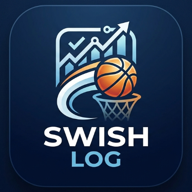

# 🏀 swish log（スウィッシュ ログ）

<p align="center">
  
</p>

スマートフォンからの観戦・ベンチでの利用に特化した、バスケットボールのリアルタイムスタッツ記録＆分析Webアプリケーションです。  
試合の素早い展開を逃さず、親指ひとつで直感的に両チームのスタッツ（シュート位置・得点・ファール等）を記録し、試合毎・選手毎に集計・可視化できます。

---

## ✨ 主な特徴

- 📱 **スマートフォン特化（Mobile First）＆ ノースクロールUI**:
  - 画面を上下にスクロールすることなく、片手・親指のみで全操作が完結する `100dvh` 設計。
  - 親指が届きやすい画面下部に大型の「⭕ 成功」「❌ 失敗」ツインボタンを配置。
- 📍 **コート上のシュート位置記録 & 2P/3P 自動判定**:
  - インタラクティブなハーフコートをタップするだけでシュート位置をピンポイント記録。
  - コートの幾何学計算により、タップ位置から「2PT」「3PT」を即時自動判定。
  - フリースロー（FT）やファールは位置指定不要のワンタップで記録可能。
- 🧒 **U12モード（ミニバス公式ルール）対応**:
  - 試合登録時に「U12モード」を選択可能。
  - 3ポイントシュートが不適用（アーク外でも全シュート2点扱い）となり、ボックススコアもミニバス仕様に最適化。
- ⏱ **クォーター別スタッツ管理 & プレイバイプレイ**:
  - 1Q / 2Q / 3Q / 4Q / OT ごとのイベント記録・集計。
  - タイムライン形式での試合展開の振り返りや、クォーター別のシュートチャート絞り込み分析に対応。
- ↩️ **充実の入力ミス防止（Undo & ログ個別削除）**:
  - 直前の入力を1タップで取り消せる「Undo」機能。
  - クォーター別のイベント履歴モーダルから、任意の過去記録を個別に削除可能。
- 💾 **オフライン対応 & LocalStorage 保存**:
  - 通信環境が不安定な体育館でも安心のローカル保存。
  - 試合結果やボックススコアは CSV 形式でダウンロード可能。

---

## 📱 画面一覧（全6画面）

| 画面名 | 主な機能・役割 |
| :--- | :--- |
| **① ホーム画面** | 試合一覧の閲覧、新規試合登録への導線、進行中の試合の再開、完了試合の閲覧。 |
| **② チーム一覧画面** | 登録済みチームの確認、新規チーム作成、チーム情報の編集・削除。 |
| **③ チーム登録/編集画面** | チーム名・略称・選手番号・名前・ポジションの登録・編集。 |
| **④ 試合登録画面** | 対戦カード（Home/Away）選択、大会名・会場・日時の入力、U12モード適用トグル、初期ロスター設定。 |
| **⑤ スタッツ登録画面** | **【ライブ記録用】** 1画面完結の親指UI。クォーター切替、選手選択、コート位置タップ、シュート成否、FT、ファール、Undo、クォーター別履歴管理。 |
| **⑥ スタッツ確認画面** | **【詳細分析・出力】** クォーター別スコアボード、3つのタブ（ボックススコア / シュート位置チャート / タイムライン）、CSVエクスポート。 |

---

## 📊 スタッツ確認画面の分析機能

1. **📋 ボックススコア**:
   - 選手別の得点（PTS）、2PT/3PT/FTの成功数・試投数・成功率（%）、オフェンス/ディフェンス/トータルファール数を一覧表示。
   - ※U12モード時は「3PT」列が自動的に非表示になります。
2. **🏀 シュート位置チャート**:
   - ハーフコート上にシュート結果をプロット（緑●: 成功 / 赤✕: 失敗）。
   - 選手別フィルター（全員 / 特定選手）およびクォーター別フィルター（全Q / 1Q / 2Q / 3Q / 4Q / OT）。
   - ペイント内 / ミドルレンジ / 3PTエリアごとの試投数・決定率サマリー。
3. **⏱ タイムライン（プレイバイプレイ）**:
   - 誰が・何クォーターのどのタイミングでどんなアクションを起こしたかを時系列で追跡。

---

## 🛠 技術スタック

- **フレームワーク**: [React 19](https://react.dev/) + [TypeScript](https://www.typescriptlang.org/)
- **ビルドツール**: [Vite](https://vite.dev/)
- **スタイリング**: [Tailwind CSS v4](https://tailwindcss.com/)
- **アイコン**: [Lucide React](https://lucide.dev/)
- **データ管理**: ブラウザ LocalStorage（起動時に初期サンプルデータを自動ロード）

---

## 🚀 環境構築 & 起動方法

### 1. 依存パッケージのインストール

```bash
npm install
```

### 2. 開発サーバーの起動

```bash
# ローカルで起動
npm run dev

# スマートフォンなど同一ネットワークの別端末からアクセスする場合
npm run dev -- --host
```

起動後、ターミナルに表示されるURL（例: `http://localhost:5173/` や `http://192.168.x.x:5173/`）にブラウザからアクセスします。

### 3. プロダクションビルド

```bash
npm run build
```

ビルドされた成果物は `dist/` ディレクトリに出力されます。

```bash
# ビルド成果物のプレビュー
npm run preview
```

---

## 📂 ディレクトリ構成

```text
├── public/                 # 静的アセット
├── src/
│   ├── components/         # UIコンポーネント
│   │   ├── common/         # 共通部品（コートSVG、モーダル等）
│   │   ├── layout/         # 共通ヘッダー・ナビゲーション
│   │   └── screens/        # 各画面コンポーネント（全6画面）
│   │       ├── HomeScreen.tsx         # ① ホーム画面
│   │       ├── TeamListScreen.tsx     # ② チーム一覧画面
│   │       ├── TeamEditScreen.tsx     # ③ チーム登録/編集画面
│   │       ├── NewGameScreen.tsx      # ④ 試合登録画面（U12対応）
│   │       ├── LiveGameScreen.tsx     # ⑤ スタッツ登録画面（親指UI）
│   │       └── GameStatsScreen.tsx    # ⑥ スタッツ確認画面（チャート・タイムライン・CSV）
│   ├── context/            # グローバルステート（AppContext）
│   ├── types/              # TypeScript 型定義
│   ├── utils/              # ユーティリティ（計算、コート座標幾何学、LocalStorage）
│   ├── App.tsx             # ルーティング＆全体レイアウト制御
│   ├── index.css           # グローバルスタイル (Tailwind CSS)
│   └── main.tsx            # エントリーポイント
├── index.html              # HTMLテンプレート（モバイル向けviewport/PWA最適化設定）
├── package.json
├── tsconfig.json
└── vite.config.ts
```

---

## 📝 ライセンス

Private / MIT License
